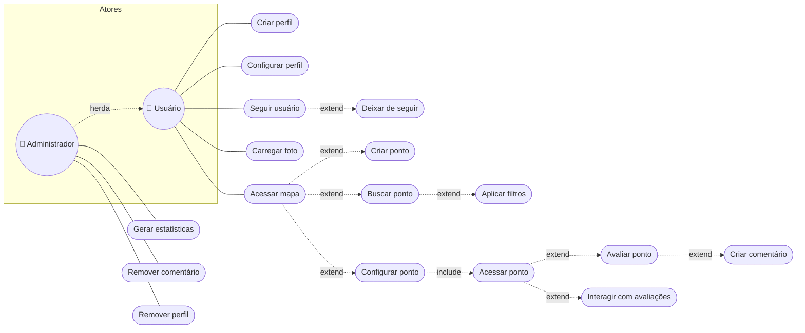

# 📋 02. Requisitos e Casos de Uso — Soromaps

> Requisitos de alto nível numerados e o diagrama de casos de uso dos dois atores (Usuário e Administrador).

---

## 🔧 Requisitos de alto nível

| ID | Requisito |
|---|---|
| RF-01 | Permitir o cadastro de contas e a exibição dos perfis dos usuários |
| RF-02 | Possibilitar a configuração dos perfis após a criação da conta |
| RF-03 | Exibir um mapa interativo |
| RF-04 | Ter acesso a GPS |
| RF-05 | Permitir a criação de pontos no mapa |
| RF-06 | Permitir a configuração de um ponto |
| RF-07 | Permitir a avaliação de um ponto |
| RF-08 | Possibilitar o upload de fotos |
| RF-09 | Permitir a criação de comentários com possibilidade de resposta |
| RF-10 | Gerar estatísticas baseadas em avaliações e exibir tendências |
| RF-11 | Permitir a busca de pontos |
| RF-12 | Oferecer filtros de busca |
| RF-13 | Permitir interações entre os usuários |

---

## 🎭 Casos de uso

Dois atores: **Usuário** (normal ou estabelecimento) e **Administrador** (herda os casos do Usuário e adiciona moderação/estatísticas).

> 🖼️ Diagrama original: `Diagrama_de_Casos_de_Uso_-_Alto_Nível.pdf` no material do TCC.

---

## 🔗 Rastreabilidade requisitos → casos de uso

| Requisito | Casos de uso relacionados |
|---|---|
| RF-01, RF-02 | Criar perfil, Configurar perfil |
| RF-03, RF-04 | Acessar mapa |
| RF-05, RF-06 | Criar ponto, Configurar ponto |
| RF-07 | Avaliar ponto |
| RF-08 | Carregar foto |
| RF-09 | Criar comentário, Interagir com avaliações |
| RF-10 | Gerar estatísticas (Administrador) |
| RF-11, RF-12 | Buscar ponto, Aplicar filtros |
| RF-13 | Seguir usuário, Deixar de seguir, Interagir com avaliações |

---

## 🧭 Decisões deste domínio

### Administrador como ator especializado
**Decisão:** Administrador herda todos os casos de Usuário e adiciona apenas moderação (remover comentário/perfil) e estatísticas globais.
**Motivo:** evita duplicar casos de uso no diagrama; a diferença real entre os papéis é só o conjunto extra de permissões, não fluxos diferentes.
