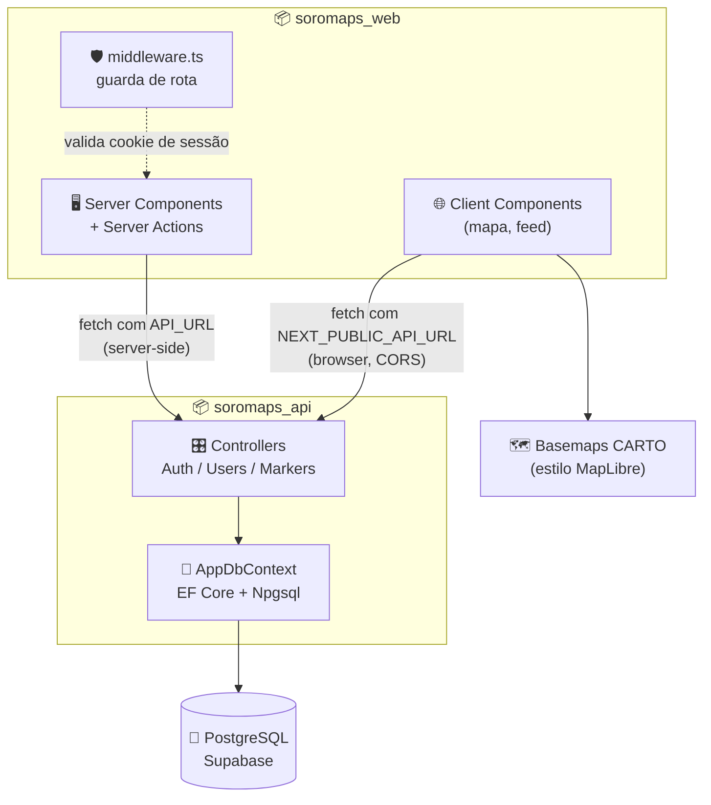
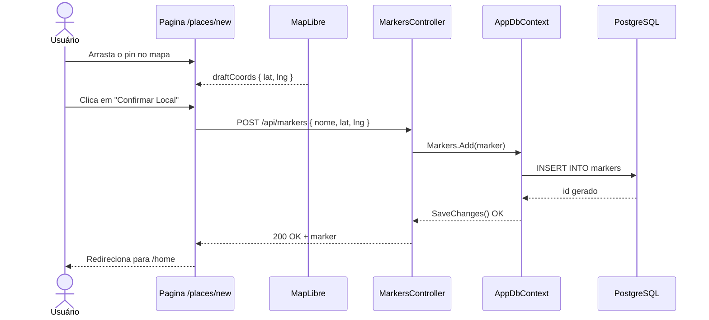
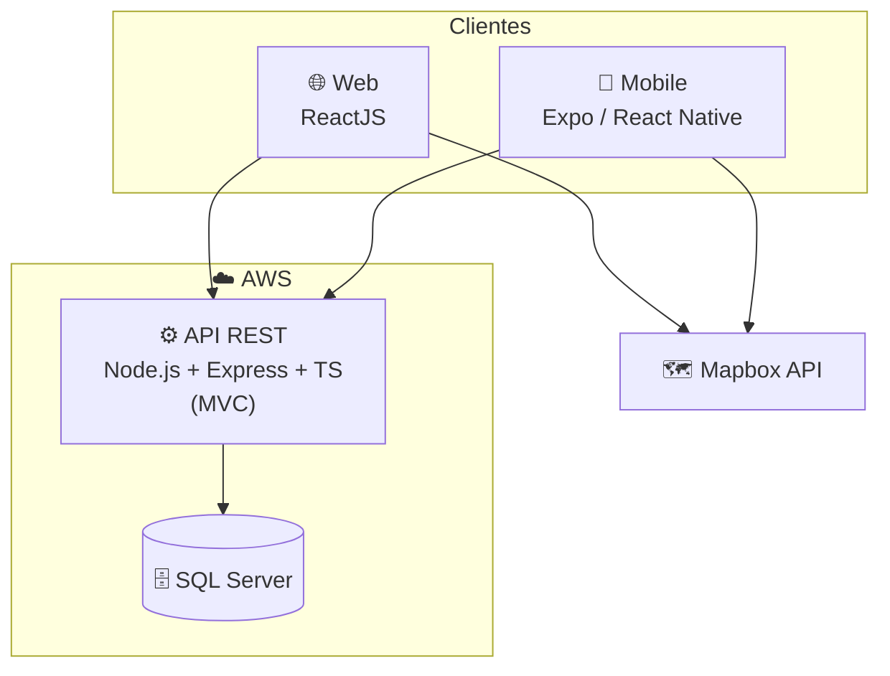

# 🏗️ 03. Arquitetura — Soromaps

> Como o sistema está montado hoje: dois repositórios, Next.js 16 na Vercel, ASP.NET Core 10 no Azure, PostgreSQL no Supabase e MapLibre no mapa. A arquitetura desenhada no TCC (Node.js + Express + SQL Server + Mapbox) está preservada ao final do documento.

---

## 📋 Visão geral

O Soromaps hoje são **dois repositórios independentes**, publicados em três provedores:

| Repo | Papel | Stack | Produção |
|---|---|---|---|
| `soromaps_web` | Aplicação web + camada de sessão | Next.js 16 (App Router), React 19, TypeScript, Tailwind 4, shadcn/ui | **Vercel** |
| `soromaps_api` | API REST + acesso a dados | ASP.NET Core 10 (`net10.0`), EF Core, Npgsql, BCrypt | **Azure App Service** |
| — | Persistência | PostgreSQL | **Supabase** |

Detalhamento dos ambientes, variáveis de produção e o estado atual do deploy em [`wiki/14-deploy.md`](./wiki/14-deploy.md).

A separação aconteceu no commit inicial da API (`a210a31 — transferido do projeto soromaps_web pra melhor separação de responsabilidades`). Antes disso, o backend .NET vivia dentro de `src/services/Soromaps` do repo web — resquícios desse caminho ainda aparecem no `.gitignore`.

**Detalhe importante:** existem *dois caminhos de rede distintos* até a API.

- **Server-side** (Server Actions e funções em `src/actions/`) usa `process.env.API_URL` — variável privada, nunca exposta ao browser.
- **Client-side** (páginas `"use client"` como `/home` e `/places/new`) usa `process.env.NEXT_PUBLIC_API_URL` e bate direto na API pelo navegador — por isso a política de CORS `AllowFrontend` em `Program.cs` libera `http://localhost:3000`.

> 🔴 Esse segundo caminho **está quebrado em produção**: a variável pública não é definida na Vercel (a URL da API virou segredo) e o CORS não conhece o domínio publicado. Diagnóstico e correção em [`wiki/14-deploy.md`](./wiki/14-deploy.md#-estado-de-produção).

---

## 🧱 Stack real

| Camada | Tecnologia | Onde |
|---|---|---|
| Web | Next.js 16 + React 19 + TypeScript | `soromaps_web` |
| UI | Tailwind CSS 4, shadcn/ui (Radix), lucide-react, sonner | `src/components/ui` |
| Mapa | MapLibre GL + basemaps CARTO (`positron` / `dark-matter`) | [`src/components/ui/map.tsx`](../src/components/ui/map.tsx) |
| Sessão | JWT HS256 assinado com Web Crypto, em cookie `httpOnly` | [`src/lib/session.ts`](../src/lib/session.ts) |
| API | ASP.NET Core 10, controllers `[ApiController]` | `soromaps_api/Controllers` |
| ORM | EF Core + `Npgsql.EntityFrameworkCore.PostgreSQL` | `soromaps_api/Data/AppDbContext.cs` |
| Hash de senha | `BCrypt.Net-Next` | `UsersController` / `AuthController` |
| Banco | PostgreSQL (Supabase em produção) | connection string `DefaultConnection` |
| Lint/format | Biome 2 | `biome.json` |

> 📄 Detalhamento por camada na wiki: [arquitetura atual](./wiki/07-arquitetura-atual.md), [endpoints](./wiki/09-api-endpoints.md), [autenticação](./wiki/10-autenticacao-e-sessao.md), [frontend](./wiki/11-frontend-web.md).

---

## 🔄 Fluxo real — criação de ponto no mapa (RF-05)

O caso de uso "criar ponto" hoje é totalmente client-side: a página `/places/new` deixa o usuário arrastar o pin e envia as coordenadas direto para a API.

Diferença estrutural em relação ao desenho do TCC: não existe camada "View → Controller → Model" no servidor web. O Next.js entrega um Client Component que fala HTTP direto com o controller .NET; o papel de "Model" é do EF Core.

---

## 🧭 Decisões deste domínio

### Backend em ASP.NET Core em vez de Node.js + Express
**Decisão:** API em C# com ASP.NET Core 10 e EF Core, em repositório próprio (`soromaps_api`).
**Motivo:** alinhamento com a stack que o time domina e com as disciplinas de C#, mais tipagem forte e ORM maduro sem montar a estrutura na mão. O MVC do desenho original continua valendo conceitualmente — `Controller` e `Model` existem literalmente; a "View" migrou pro Next.js.

### PostgreSQL em vez de SQL Server
**Decisão:** persistência em PostgreSQL via `Npgsql.EntityFrameworkCore.PostgreSQL`.
**Motivo:** custo zero de licença, provisionamento simples em qualquer provedor gratuito e suporte natural a extensão geoespacial (PostGIS) caso a busca por raio saia do papel — o que SQL Server encareceria. Alternativa descartada: SQL Server, que era a escolha do TCC por familiaridade da disciplina.

### MapLibre GL + basemaps CARTO em vez de Mapbox
**Decisão:** renderizar o mapa com MapLibre GL consumindo estilos públicos da CARTO.
**Motivo:** MapLibre é fork open-source do Mapbox GL sem exigência de token nem cota de requisições — some a dependência de conta paga e de chave em variável de ambiente. Os estilos `positron` (claro) e `dark-matter` (escuro) ainda casam com o tema do app.

### Repositórios separados para web e API
**Decisão:** dois repos em vez de monorepo.
**Motivo:** deploys independentes (web em plataforma Node, API em host .NET) e histórico de commits limpo por responsabilidade. Custo aceito: mudanças de contrato entre front e API precisam ser coordenadas em dois PRs.

### Sessão emitida pelo Next.js, não pela API
**Decisão:** a API valida credenciais e devolve os dados do usuário; quem assina o token de sessão é o Next.js ([`src/lib/session.ts`](../src/lib/session.ts)), guardando-o em cookie `httpOnly`.
**Motivo:** permite proteger rotas no `middleware.ts` (Edge) sem round-trip à API a cada navegação. **Consequência conhecida:** a API em si continua sem autenticação — ver [riscos](./wiki/10-autenticacao-e-sessao.md).

---

## 📜 Como foi projetado no TCC

O desenho original previa uma API Node.js + Express + TypeScript em MVC, SQL Server na AWS e Mapbox como provedor de mapas, com web (ReactJS) e mobile (Expo) consumindo a mesma API.

O que se manteve: API REST única para web e mobile, separação clara entre apresentação e regra de negócio, e o fluxo de casos de uso. O que mudou: linguagem/framework da API, banco, provedor de mapas e a topologia de repositórios. O app mobile em Expo ainda não foi iniciado.

Detalhamento completo do desenho original — incluindo o diagrama de sequência MVC — em [`wiki/04-arquitetura-projetada.md`](./wiki/04-arquitetura-projetada.md). Export original: [`archive/diagramas-originais/Diagrama-de-Sequencia.png`](./archive/diagramas-originais/Diagrama-de-Sequencia.png).

---

## 📚 Glossário

| Termo | Significado |
|---|---|
| MVC | Model-View-Controller — separa dados (Model), apresentação (View) e orquestração (Controller) |
| API REST | Interface HTTP com recursos e verbos padronizados (GET/POST/PUT/DELETE) |
| Server Action | Função `"use server"` do Next.js executada no servidor e chamada direto do componente, sem criar endpoint manual |
| CORS | Política que autoriza o browser a chamar uma origem diferente da que serviu a página |
| Basemap | Camada de fundo do mapa (ruas, relevo, rótulos) sobre a qual os marcadores são desenhados |
