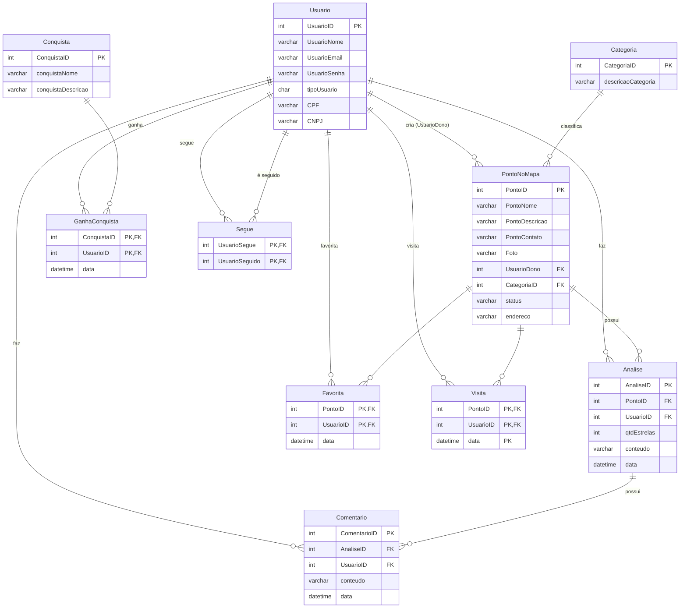
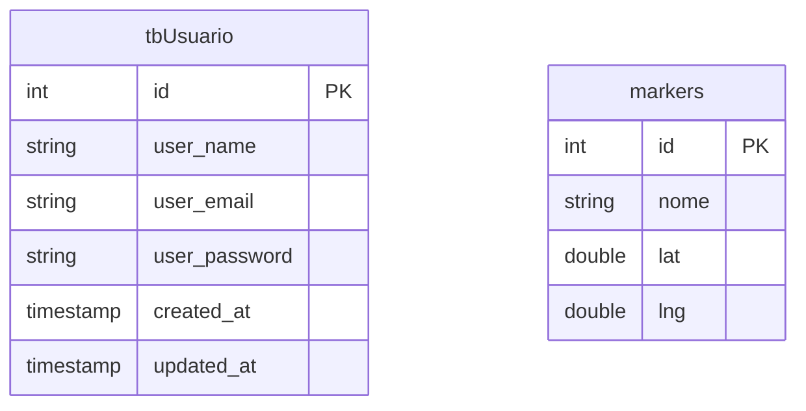

# 🗄️ 04. Database — Soromaps

> Modelagem de dados em três níveis: conceitual (classes), DER e modelo lógico, com o ERD em Mermaid como fonte de verdade. Ao final, o **estado realmente implementado** hoje no PostgreSQL — que é bem menor que o modelo.

---

## 📋 Visão geral

A modelagem gira em torno de três entidades centrais: **Usuário** (normal ou estabelecimento), **Ponto no mapa** e **Análise** (avaliação com estrelas). As demais entidades dão suporte à rede social (Segue, Comentário), à gamificação (Conquista/GanhaConquista) e ao histórico de uso (Visita, Favorita).

Os três níveis de modelagem:

| Nível | Artefato | Export original |
|---|---|---|
| Conceitual (OO) | Diagrama de classes | [`diagrama-conceitual.png`](./archive/diagramas-originais/diagrama-conceitual.png) |
| Conceitual (ER) | DER com atributos | [`Diagrama_Entidade-Relacionamento.png`](./archive/diagramas-originais/Diagrama_Entidade-Relacionamento.png) |
| Lógico | Tabelas + tipos + PK/FK | [`Modelo-Logico.png`](./archive/diagramas-originais/Modelo-Logico.png) |

> ⚠️ **Este documento descreve o modelo projetado.** O banco em produção hoje tem apenas duas tabelas — ver [Estado implementado](#-estado-implementado) e a página de gap na wiki: [`wiki/12-gap-modelo-vs-implementacao.md`](./wiki/12-gap-modelo-vs-implementacao.md).

---

## 🔧 Modelo lógico projetado (ERD)

---

## 📇 Catálogo de tabelas

| Tabela | Papel | Chave |
|---|---|---|
| `Usuario` | Contas (normal via CPF, estabelecimento via CNPJ) | `UsuarioID` |
| `PontoNoMapa` | Estabelecimentos/locais no mapa | `PontoID` |
| `Categoria` | Catálogo de categorias de ponto | `CategoriaID` |
| `Analise` | Avaliação (estrelas + texto) de um ponto por um usuário | `AnaliseID` |
| `Comentario` | Comentário/resposta em uma análise | `ComentarioID` |
| `Favorita` | N:N usuário ↔ ponto favoritado | `(PontoID, UsuarioID)` |
| `Visita` | Histórico de visitas (permite revisita) | `(data, PontoID, UsuarioID)` |
| `Segue` | Auto-relacionamento N:N de usuários | `(UsuarioSegue, UsuarioSeguido)` |
| `Conquista` | Catálogo de conquistas da gamificação | `ConquistaID` |
| `GanhaConquista` | N:N usuário ↔ conquista, com data | `(ConquistaID, UsuarioID)` |

---

## 🔀 Do conceitual ao lógico — o que mudou

- **Herança → single table:** no conceitual, `UsuarioNormal` (pontuação, nível) e `Estabelecimento` (qtdPontosPossui) herdam de `Usuario`. No lógico, viraram uma tabela única com discriminador `tipoUsuario` + `CPF`/`CNPJ` opcionais.
- **`Endereco` → coluna:** a classe `Endereco` (cep, rua, número...) foi achatada em `PontoNoMapa.endereco` no lógico, simplificando o schema.
- **`Coordenadas` sumiu do lógico:** o DER traz `Coordenadas` como atributo de `Ponto no mapa`, mas o modelo lógico não tem coluna equivalente. É uma **lacuna do modelo**, não uma simplificação deliberada — sem coordenada não há como plotar o ponto. A implementação atual resolveu por conta própria com duas colunas `double` (`lat`, `lng`) na tabela `markers`.
- **`Feed` e `Badge` ficaram de fora do lógico:** presentes no conceitual como visão de produto, mas fora do escopo do MVP do banco (conquistas cobrem a gamificação inicial).

---

## 🧭 Decisões deste domínio

### Single table para tipos de usuário
**Decisão:** `tipoUsuario` (CHAR) discriminando normal/estabelecimento na mesma tabela, com `CPF` e `CNPJ` nullable.
**Motivo:** os dois tipos compartilham quase todos os relacionamentos (avaliar, comentar, seguir, criar ponto); tabelas separadas exigiriam FK polimórfica ou duplicação em toda tabela associativa.

### `data` na PK de `Visita`
**Decisão:** PK composta `(data, PontoID, UsuarioID)` em vez de só `(PontoID, UsuarioID)`.
**Motivo:** o mesmo usuário pode visitar o mesmo ponto várias vezes — o histórico completo alimenta as estatísticas (RF-10). `Favorita` não tem `data` na PK porque favoritar é estado, não evento.

### Comentário pendurado na Análise, não no Ponto
**Decisão:** `Comentario.AnaliseID` como FK, não `PontoID`.
**Motivo:** atende o RF-09 (comentários *com resposta*): comentários são conversas em torno de uma avaliação específica, como respostas a uma resenha — não um mural solto do estabelecimento.

---

## 🚧 Estado implementado

O banco que a API realmente usa hoje tem **duas tabelas**, mapeadas por Data Annotations em `soromaps_api/Models` e registradas em `AppDbContext`:

Não há relacionamento entre elas: `markers` não guarda quem criou o ponto. Também não existem `Analise`, `Comentario`, `Categoria`, `Favorita`, `Visita`, `Segue`, `Conquista` nem `GanhaConquista` — ou seja, avaliações, rede social e gamificação ainda não têm base de dados.

| Modelado | Implementado | Situação |
|---|---|---|
| `Usuario` (com `tipoUsuario`, CPF, CNPJ) | `tbUsuario` (sem discriminador, sem CPF/CNPJ) | Parcial |
| `PontoNoMapa` (9 colunas, FK dono e categoria) | `markers` (`id`, `nome`, `lat`, `lng`) | Parcial |
| `Categoria`, `Analise`, `Comentario` | — | Ausente |
| `Favorita`, `Visita`, `Segue` | — | Ausente |
| `Conquista`, `GanhaConquista` | — | Ausente |

Duas observações que valem virar tarefa:

1. **Sem migrations.** O projeto não tem `Migrations/` nem pacote `Microsoft.EntityFrameworkCore.Design` — o schema hoje é criado manualmente no banco. Sem isso, o modelo lógico acima nunca sai do papel de forma reproduzível.
2. **Nomenclatura mista.** `tbUsuario` usa prefixo húngaro e colunas em `snake_case` inglês (`user_name`); `markers` usa nome plural inglês com colunas em português (`nome`). Convém padronizar antes de o schema crescer.

Análise completa do gap: [`wiki/12-gap-modelo-vs-implementacao.md`](./wiki/12-gap-modelo-vs-implementacao.md).

---

## 📚 Glossário

| Termo | Significado |
|---|---|
| DER | Diagrama Entidade-Relacionamento — modelagem conceitual com entidades, atributos e cardinalidades |
| Single Table Inheritance | Representar uma hierarquia de classes em uma única tabela com coluna discriminadora |
| Tabela associativa | Tabela que materializa um relacionamento N:N, podendo carregar atributos próprios (ex.: `data`) |
