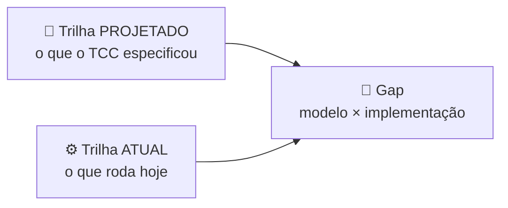

# 🏠 Wiki do Soromaps

O Soromaps é uma plataforma interativa para descobrir, avaliar e compartilhar experiências em estabelecimentos locais de Sorocaba, com geolocalização + gamificação + rede social. TCC da FATEC Sorocaba.

Esta wiki tem **duas trilhas paralelas** e uma ponte entre elas. Isso é proposital: o Soromaps foi projetado com uma stack no papel e implementado com outra, e as duas coisas importam — a modelagem é o entregável acadêmico, o código é o produto.

---

## 📐 Trilha 1 — Projetado (TCC)

O que foi especificado, modelado e apresentado. Vale como referência de destino do produto.

| Página                                                      | Conteúdo                                                    |
| ----------------------------------------------------------- | ----------------------------------------------------------- |
| [01 — Visão geral](./01-visao-geral.md)                     | Produto, dores atacadas, modelo de negócio, personas        |
| [02 — Requisitos](./02-requisitos.md)                       | RF-01 a RF-13 e rastreabilidade para casos de uso           |
| [03 — Casos de uso](./03-casos-de-uso.md)                   | Atores, casos, relações `include`/`extend`                  |
| [04 — Arquitetura projetada](./04-arquitetura-projetada.md) | Stack original (Node/Express/SQL Server/Mapbox) e fluxo MVC |
| [05 — Modelagem projetada](./05-modelagem-projetada.md)     | Diagrama de classes, DER e modelo lógico (10 tabelas)       |
| [06 — Protótipo](./06-prototipo.md)                         | Lovable, Figma e os vídeos de apresentação                  |

---

## ⚙️ Trilha 2 — Atual (implementado)

O que existe rodando hoje, extraído do código dos dois repositórios.

| Página                                                      | Conteúdo                                                          |
| ----------------------------------------------------------- | ----------------------------------------------------------------- |
| [07 — Arquitetura atual](./07-arquitetura-atual.md)         | Dois repos, Next.js 16 + ASP.NET Core 10 + Supabase + MapLibre    |
| [08 — Banco atual](./08-banco-atual.md)                     | As duas tabelas reais (`tbUsuario`, `markers`) e o que falta      |
| [09 — Endpoints da API](./09-api-endpoints.md)              | Catálogo completo de rotas, payloads e respostas                  |
| [10 — Autenticação e sessão](./10-autenticacao-e-sessao.md) | Fluxo de login, cookie HS256, middleware — e os riscos conhecidos |
| [11 — Frontend web](./11-frontend-web.md)                   | App Router, Server Actions, mapa, organização de pastas           |
| [13 — Ambiente e setup](./13-ambiente-e-setup.md)           | Como rodar web + API, variáveis de ambiente, portas               |
| [14 — Deploy e infraestrutura](./14-deploy.md)              | Vercel + Azure + Supabase, variáveis de produção e o defeito conhecido do mapa |

---

## 🔀 Ponte

| Página                                                                 | Conteúdo                                                                     |
| ---------------------------------------------------------------------- | ---------------------------------------------------------------------------- |
| [12 — Gap modelo × implementação](./12-gap-modelo-vs-implementacao.md) | Tabela entidade a entidade, drift de stack, código morto, backlog priorizado |

---

## 🧭 Como usar

- **Chegou agora no projeto?** [01](./01-visao-geral.md) → [07](./07-arquitetura-atual.md) → [13](./13-ambiente-e-setup.md). Em meia hora dá pra rodar tudo local.
- **Vai mexer no banco ou na API?** [12](./12-gap-modelo-vs-implementacao.md) primeiro, depois [08](./08-banco-atual.md) e [09](./09-api-endpoints.md).
- **Vai apresentar/documentar o TCC?** Trilha 1 inteira, na ordem.
- **Vai mexer em login?** [10](./10-autenticacao-e-sessao.md) — inclusive a seção de riscos.
- **Vai publicar ou mexer em produção?** [14](./14-deploy.md) — inclui o defeito que hoje derruba o mapa em produção.

---

## 📎 Fora da wiki

| Onde                                    | O quê                                                                                    |
| --------------------------------------- | ---------------------------------------------------------------------------------------- |
| [`/docs`](../)                          | Docs numerados de referência (visão geral, requisitos, arquitetura, database, protótipo) |
| [`/docs/todo`](../todo/README.md)       | Módulos de produto pendentes por área (usuário, estabelecimento, admin)                  |
| [`/docs/archive`](../archive/README.md) | Exports originais dos diagramas e material histórico                                     |
| [`/CLAUDE.md`](../../CLAUDE.md)         | Registro vivo: decisões arquiteturais com data e estado atual do roadmap                 |
| [`/README.md`](../../README.md)         | Porta de entrada pública do repositório                                                  |
