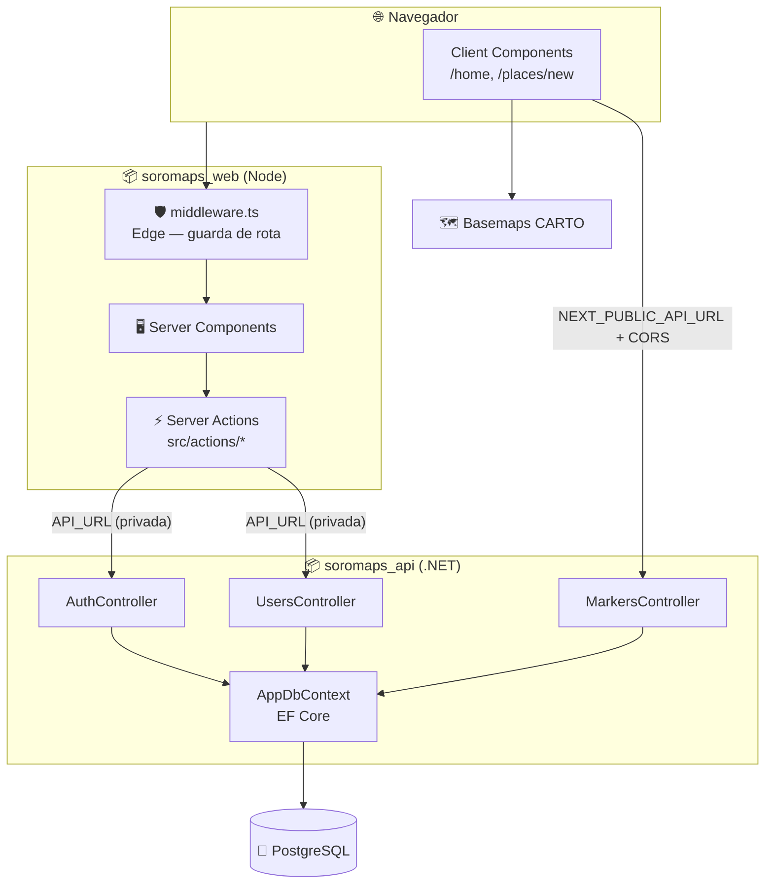

> ⚙️ **Trilha: implementado.** Extraído do código dos dois repositórios. O desenho original está em [04 — Arquitetura projetada](./04-arquitetura-projetada.md).

# ⚙️ 07. Arquitetura atual

Dois repositórios independentes, com contrato HTTP entre eles:

| Repo | Papel | Stack | Porta padrão |
|---|---|---|---|
| `soromaps_web` | App web + camada de sessão | Next.js 16, React 19, TypeScript, Tailwind 4 | `3000` |
| `soromaps_api` | API REST + acesso a dados | ASP.NET Core 10 (`net10.0`), EF Core, Npgsql | definida no `launchSettings.json` |

A separação foi feita no commit inicial da API: *"transferido do projeto soromaps_web pra melhor separação de responsabilidades"*. O backend antes vivia em `src/services/Soromaps` dentro do repo web — sobraram entradas desse caminho no [`.gitignore`](../../.gitignore).

---

## 🗺️ Topologia



---

## 🔀 Os dois caminhos até a API

Essa é a característica arquitetural menos óbvia do projeto e a que mais confunde quem chega:

| Caminho | Quem usa | Variável | Exposto no browser? |
|---|---|---|---|
| **Server-side** | Server Actions e funções em `src/actions/` | `API_URL` | Não |
| **Client-side** | Páginas `"use client"` (`/home`, `/places/new`, popup do marcador) | `NEXT_PUBLIC_API_URL` | Sim |

Consequências práticas:

- **Auth e CRUD de usuário** passam pelo servidor Next.js — a URL da API fica privada e o cookie é setado no mesmo request.
- **Markers** são chamados direto do navegador. Por isso `Program.cs` precisa da política de CORS:

```csharp
builder.Services.AddCors(options =>
{
    options.AddPolicy(
        "AllowFrontend",
        policy => policy.WithOrigins("http://localhost:3000").AllowAnyMethod().AllowAnyHeader()
    );
});
```

> ⚠️ A origem está **fixa em `http://localhost:3000`**. Em deploy, o domínio real precisa entrar aqui (idealmente via configuração, não hard-coded) ou toda chamada client-side de markers quebra.

---

## 🧱 Camadas do repo web

| Camada | Pasta | Papel |
|---|---|---|
| Rotas | `src/app` | App Router: route groups `(app)` e `(auth)`, rotas interceptadas `@modals` |
| Server Actions | `src/actions` | Mutações e chamadas server-side (`auth.ts`, `users/*`) |
| Sessão | `src/lib/session.ts` | Assina e valida o JWT HS256 com Web Crypto |
| Guarda de rota | `src/middleware.ts` | Roda no Edge; redireciona por presença de sessão |
| UI | `src/components/{ui,blocks,table,skeletons}` | shadcn/ui + composições próprias |
| Validação | `src/validations` | Schemas Zod de login, cadastro e avaliação |
| Tipos | `src/types` | Contratos de `User` e `Review` |

A árvore segue o padrão Dara (Stardust) — detalhe e desvios em [11 — Frontend web](./11-frontend-web.md).

---

## 🧱 Camadas do repo API

| Camada | Pasta | Conteúdo |
|---|---|---|
| Controllers | `Controllers/` | `AuthController`, `UsersController`, `MarkersController`, `WeatherForecastController` (resto do template) |
| DTO | `DTO/` | `LoginDTO`, `UserDTO`, `MarkerDTO` |
| Models | `Models/` | `User` → `tbUsuario`, `Marker` → `markers` (mapeados por Data Annotations) |
| Dados | `Data/AppDbContext.cs` | `DbSet<User>`, `DbSet<Marker>` |

Pacotes: `Npgsql.EntityFrameworkCore.PostgreSQL`, `BCrypt.Net-Next`, `Microsoft.AspNetCore.OpenApi`.

Os controllers acessam o `AppDbContext` diretamente — não há camada de serviço nem repositório. Para o tamanho atual (2 entidades, CRUD puro) funciona; quando entrarem regras de gamificação e agregação de estatísticas, vai pedir uma camada intermediária.

---

## 🧭 Decisões deste domínio

### Repositórios separados
**Decisão:** `soromaps_web` e `soromaps_api` como repos distintos.
**Motivo:** deploy independente (host Node × host .NET) e histórico limpo por responsabilidade. Custo aceito: mudança de contrato exige PR coordenado nos dois lados.

### Controllers falando direto com o DbContext
**Decisão:** sem camada de serviço/repositório por enquanto.
**Motivo:** CRUD puro sobre duas entidades — abstração extra seria cerimônia sem ganho. Revisitar quando entrar regra de negócio de verdade (estatísticas, conquistas).

### MapLibre + CARTO em vez de Mapbox
**Decisão:** MapLibre GL renderizando estilos públicos da CARTO (`positron` claro, `dark-matter` escuro).
**Motivo:** sem token, sem conta, sem cota — e o tema do mapa acompanha o tema do app automaticamente, detectando a classe `dark` no `<html>`. Alternativa descartada: Mapbox GL, que exigiria chave em variável de ambiente e teria cota mensal.

### Fetch client-side para markers
**Decisão:** `/home` e `/places/new` chamam a API direto do navegador em vez de usar Server Actions.
**Motivo:** o mapa é interativo — recarrega marcadores conforme o zoom muda (`viewport.zoom >= 14`), o que casa com `useEffect` no cliente. **Custo:** obriga CORS e expõe a URL da API. Migrar para Server Action + revalidação é possível, mas exigiria repensar o carregamento por zoom.

---

## ➡️ Próxima página

[08 — Banco atual](./08-banco-atual.md)
