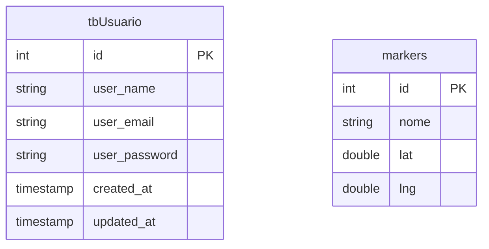

> ⚙️ **Trilha: implementado.** O modelo de 10 tabelas do TCC está em [05 — Modelagem projetada](./05-modelagem-projetada.md); o que falta, em [12 — Gap](./12-gap-modelo-vs-implementacao.md).

# 🐘 08. Banco atual

PostgreSQL gerenciado no **Supabase**, acessado via EF Core com o provider `Npgsql.EntityFrameworkCore.PostgreSQL`. **Duas tabelas**, ambas mapeadas por Data Annotations nos models de `soromaps_api/Models`.

A connection string vive nas Application Settings do Azure App Service (`ConnectionStrings__DefaultConnection`) e nunca entra no repositório — ver [14 — Deploy](./14-deploy.md).



Não há linha ligando as duas: **`markers` não sabe quem criou o ponto**. No modelo projetado isso seria `PontoNoMapa.UsuarioDono`.

---

## 📇 `tbUsuario`

Mapeada por `Models/User.cs`:

```csharp
[Table("tbUsuario")]
public class User
{
    [Column("id")] public int Id { get; set; }
    [Column("user_name")] public string UserName { get; set; }
    [Column("user_email")] public string Email { get; set; }
    [Column("user_password")] public string Password { get; set; }
    [Column("created_at")] public DateTime CreatedAt { get; set; }
    [Column("updated_at")] public DateTime UpdatedAt { get; set; }
}
```

| Coluna | Tipo .NET | Observação |
|---|---|---|
| `id` | `int` | PK por convenção do EF Core (propriedade `Id`) |
| `user_name` | `string` | **É o identificador de login** — ver [10 — Autenticação](./10-autenticacao-e-sessao.md) |
| `user_email` | `string` | Obrigatório no cadastro (`createUserSchema`), mas não usado para autenticar |
| `user_password` | `string` | Hash BCrypt, gerado em `UsersController.Create` |
| `created_at` / `updated_at` | `DateTime` | Preenchidos manualmente com `DateTime.UtcNow` no controller |

**Ausentes em relação ao modelo:** `tipoUsuario`, `CPF`, `CNPJ`, `pontuacao`, `nivel`. Sem `tipoUsuario` não existe distinção entre usuário comum e estabelecimento — que é a base das personas e do modelo de negócio.

Também não há constraint de unicidade declarada em `user_name` ou `user_email`. Como o login busca por `user_name`, duplicatas fariam `FirstOrDefault` devolver sempre a primeira linha encontrada.

---

## 📍 `markers`

Mapeada por `Models/Marker.cs`:

```csharp
[Table("markers")]
public class Marker
{
    [Column("id")] public int Id { get; set; }
    [Column("nome")] public string Nome { get; set; }
    [Column("lat")] public double Lat { get; set; }
    [Column("lng")] public double Lng { get; set; }
}
```

| Coluna | Tipo .NET | Observação |
|---|---|---|
| `id` | `int` | PK |
| `nome` | `string` | Hoje sempre criado como `"Novo Ponto"` pela tela `/places/new` |
| `lat` / `lng` | `double` | Resolvem o `Coordenadas` que o modelo lógico esqueceu |

**Ausentes em relação ao modelo:** `PontoDescricao`, `PontoContato`, `Foto`, `UsuarioDono` (FK), `CategoriaID` (FK), `status`, `endereco`.

Sem `status` não há moderação de ponto; sem `UsuarioDono` não dá para saber quem criou nem aplicar permissão de edição — hoje qualquer um edita ou apaga qualquer marcador.

---

## ⚠️ Sem migrations

O projeto **não tem pasta `Migrations/`** nem o pacote `Microsoft.EntityFrameworkCore.Design`. O schema foi criado **manualmente no SQL Editor do Supabase**, e o EF Core só o consome.

Implicações:

- Não existe forma reproduzível de subir o banco do zero — quem clona o repo precisa do DDL por fora.
- Mudança de model não gera diff versionado.
- O modelo lógico do TCC não tem caminho automático para virar schema.
- Ambiente local e Supabase podem divergir sem ninguém perceber: são dois schemas mantidos à mão, sem nada que os compare.

Primeiro passo para resolver:

```bash
dotnet add package Microsoft.EntityFrameworkCore.Design
dotnet ef migrations add InitialCreate
dotnet ef database update
```

---

## 🔤 Nomenclatura inconsistente

| Tabela | Padrão do nome | Padrão das colunas |
|---|---|---|
| `tbUsuario` | Prefixo `tb` + português singular | `snake_case` em inglês (`user_name`) |
| `markers` | Plural em inglês, sem prefixo | Misto: `nome` (pt), `lat`/`lng` (universal) |

Três convenções diferentes em duas tabelas. Vale padronizar antes de criar as próximas oito — a escolha importa menos que a consistência.

---

## 🧭 Decisões deste domínio

### `lat`/`lng` como colunas `double` separadas
**Decisão:** guardar a coordenada em dois `double` em vez de um tipo geográfico.
**Motivo:** é exatamente o que MapLibre consome (`[lng, lat]`), sem conversão. Alternativa a considerar quando entrar busca por raio (RF-11): PostGIS com `geography(Point)`, que dá índice espacial e cálculo de distância nativo — hoje seria complexidade sem uso.

### Hash BCrypt na aplicação, não no banco
**Decisão:** `BCrypt.Net.BCrypt.HashPassword` no controller, gravando o hash pronto.
**Motivo:** mantém o banco agnóstico e o custo do algoritmo configurável em código.

---

## ➡️ Próxima página

[09 — Endpoints da API](./09-api-endpoints.md)
