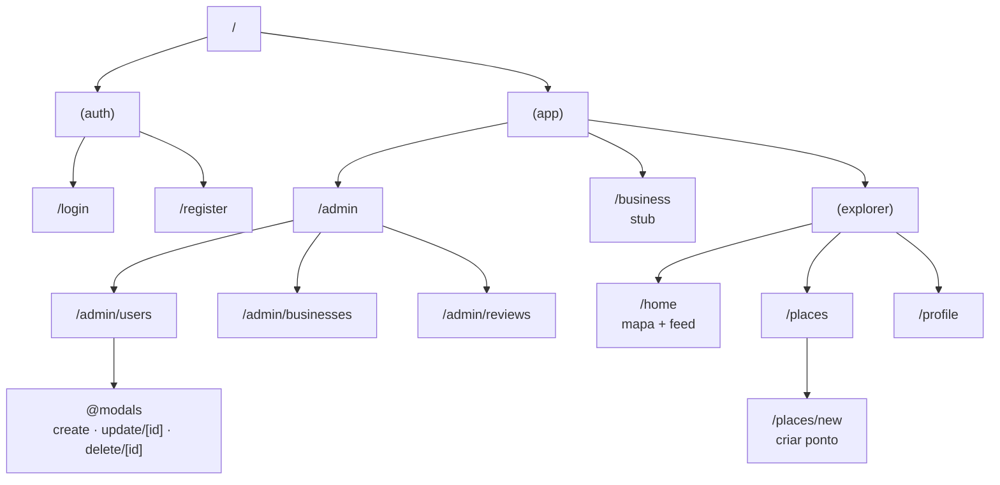
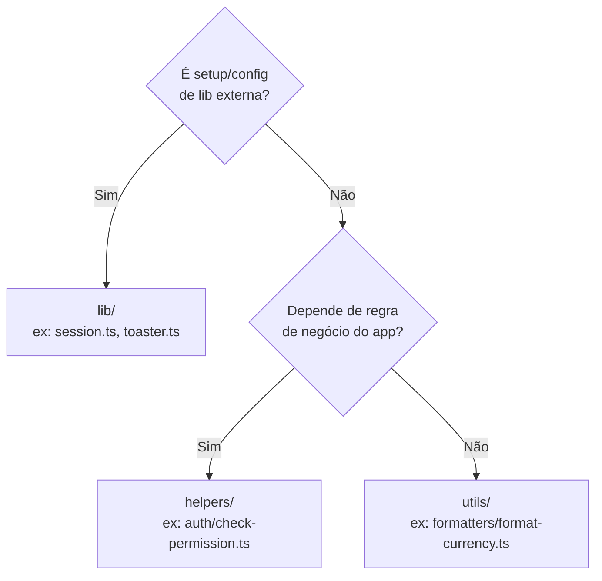
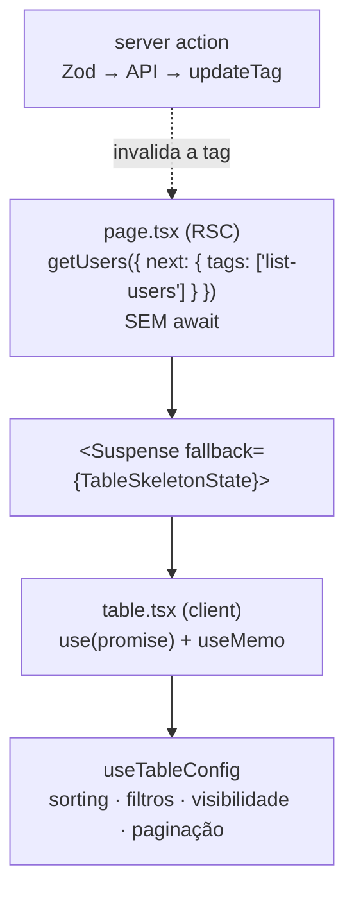

> ⚙️ **Trilha: implementado.** Estrutura do repo `soromaps_web`.

# 💻 11. Frontend web

Next.js 16 com App Router, React 19, TypeScript, Tailwind CSS 4 e shadcn/ui. Lint e formatação com Biome.

```bash
npm run dev      # servidor de desenvolvimento
npm run build    # build de produção
npm run lint     # biome check
npm run format   # biome format --write
```

---

## 🗺️ Mapa de rotas



| Route group | Papel |
|---|---|
| `(auth)` | Telas públicas de login e cadastro. Sessão ativa aqui redireciona para `/home` |
| `(app)` | Área autenticada, com sidebar e `@modals` compartilhados no `layout.tsx` — envolve os três tipos abaixo |
| `(explorer)` | Rotas do usuário comum (`/home`, `/places`, `/profile`) — agrupadas só por não terem prefixo de URL em comum |

`admin/` e `business/` não precisam de route group próprio: já são pastas reais com prefixo de URL (`/admin/*`, `/business/*`), o que já as agrupa. Route group (pasta entre parênteses) nunca aparece na URL — serve para compartilhar layout, ou só organizar por pasta, sem adicionar segmento de rota.

### Rotas interceptadas em `/admin/users`

`@modals` é um **slot paralelo** que, junto com as rotas `(.)edit/[id]` e `(.)delete/[id]`, faz edição e exclusão abrirem como modal por cima da listagem quando a navegação parte de dentro do app — mas renderizarem como página inteira quando a URL é acessada diretamente ou recarregada. As rotas completas `edit/[id]` e `delete/[id]` existem exatamente para esse segundo caso, e `@modals/default.tsx` é o estado neutro do slot.

---

## 📂 Organização de pastas

O projeto adota o padrão **Dara (Stardust)**:

| Pasta | Papel | Estado |
|---|---|---|
| `src/app` | Rotas do App Router | Em uso |
| `src/actions` | Server Actions (`auth.ts`, `users.ts`) | Em uso |
| `src/http` | Clientes HTTP por recurso (`users/users.ts`) | Em uso |
| `src/components` | `ui/` (shadcn), `blocks/`, `table/` | Em uso |
| `src/constants` | Constantes (`auth_constants.ts`, `users.ts` com tags de cache e defaults de filtro) | Em uso |
| `src/hooks` | Hooks (`use-mobile.ts`, `table/use-table-config.ts`) | Em uso |
| `src/lib` | Setup de libs externas e utilitários de infra (`session.ts`, `utils.ts`, `toaster.ts`) | Em uso |
| `src/types` | Contratos (`user`, `review`, `form`, `table`) | Em uso |
| `src/utils` | `formatters/`, `sorts/`, `table/`, `http/` | Em uso |
| `src/validations` | Schemas Zod (`auth`, `users`, `review`) | Em uso |
| `src/config`, `src/content`, `src/contexts`, `src/helpers`, `src/mocks`, `src/reducers`, `src/styles` | Criadas pelo scaffold Dara | Vazias, aguardando uso real |

### Onde colocar um arquivo novo



### Desvio consciente do Dara: `_components/` colocado

O Dara diz que `app/` deve conter só rotas (`layout`, `page`, `loading`, `error`, `not-found`). Este projeto **mantém `_components/` dentro das rotas** — `home/_components/marker.tsx`, `admin/users/_components/columns.tsx` e afins.

**Motivo:** pasta com prefixo `_` é *private folder* do App Router (fica fora do roteamento por definição), e colocação é o idioma da comunidade Next.js para componente de uso exclusivo de uma rota. Empurrar tudo para `src/components/` afastaria o componente do único lugar que o usa.

**Regra prática:** usado por uma rota só → `_components/` daquela rota. Usado por duas ou mais → `src/components/`.

---

## 📋 Padrão de tela de listagem

Toda tela com tabela do sistema segue a mesma estrutura, adotada do padrão interno de telas usado pelo time. O objetivo é que criar a próxima listagem seja **preencher lacunas**, não redesenhar a arquitetura. Referência viva: `/admin/users`.

### O princípio

> **Cada arquivo responde a uma pergunta, e só a ela.**

| Arquivo | Pergunta que responde |
|---|---|
| `page.tsx` | Quais dados esta tela precisa? |
| `_components/table.tsx` | Como as peças da tabela se encaixam? |
| `_components/columns.tsx` | Como cada coluna se comporta e se apresenta? |
| `_components/toolbar.tsx` | O que o usuário pode fazer com a listagem? |
| `_components/filter-form.tsx` | Quais campos filtram, e como viram filtro de coluna? |
| `_components/row-action.tsx` / `page-action.tsx` | Para onde o usuário navega? |
| `src/validations/*` | O que é um valor válido? |
| `src/actions/*` | Como se escreve no servidor? |

Quando um desses arquivos começa a responder mais de uma pergunta, ele é quebrado.

### Anatomia

```
src/app/(app)/admin/users/
├── page.tsx                      Server Component: promises + layout
├── create/page.tsx               rota espelho — só redirect()
├── update/[id]/page.tsx          idem
├── delete/[id]/page.tsx          idem
└── _components/
    ├── table.tsx                 orquestrador (client)
    ├── columns.tsx               colunas + rótulos + visibilidade
    ├── toolbar.tsx               busca, sheet de filtro, reset, colunas
    ├── filter-form.tsx           campos do filtro (RHF)
    ├── filter-form-skeleton.tsx  fallback do Suspense do sheet
    ├── row-action.tsx            menu de ações da linha
    └── page-action.tsx           botão principal do cabeçalho

src/app/(app)/@modals/admin/(.)users/
├── _components/user-form.tsx     form compartilhado criar/editar
├── _components/user-form-modal.tsx
├── _components/delete-user-modal.tsx
├── create/page.tsx
├── update/[id]/page.tsx
└── delete/[id]/page.tsx
```

### Fluxo de dados



Três regras que amarram tudo:

1. **A promise não é aguardada no `page.tsx`.** Com `await`, o cabeçalho da página só seria enviado depois da API responder. Sem ele, o shell vai no primeiro byte e só a tabela chega por streaming. Quem desembrulha é quem precisa do valor, com `use()`.
2. **Erro de leitura é um status, não uma exceção.** A resposta de `src/http` é uma união discriminada; o consumidor faz `status === 200 ? data : []`. Não existe `try/catch` na leitura.
3. **Escrita invalida a tag que leu.** `updateTag('list-users')` na server action é o que faz a tabela recarregar sozinha quando o modal fecha — por isso **não existe `router.refresh()`** depois de salvar.

### A instância da tabela

**Nunca chame `useReactTable` dentro de `_components/`.** A instância vem de [`useTableConfig`](../../src/hooks/table/use-table-config.ts), que centraliza estado, row models e as decisões de produto (ordenação sem estado neutro, seleção múltipla). Um hook por tela faria correção de bug virar um PR por tela, e as telas divergiriam em silêncio.

Precisa de uma opção do TanStack não exposta? A assinatura estende `Partial<TableOptions>` — passe direto, sem forkar o hook.

### Contratos fáceis de quebrar

| Contrato | O que quebra se ignorado |
|---|---|
| Chaves do schema de filtro = ids das colunas | `resolveFilters` gera filtro para coluna inexistente; some sem erro |
| `id="form:submit"` no form do sheet | O botão "Aplicar filtros" para de funcionar, sem aviso |
| `data` e `columns` memoizados no orquestrador | A tabela remonta a cada render e perde ordenação, filtros e página |
| `useForm` do filtro na **toolbar**, não no form | O `filter-form` suspende; o estado do formulário seria descartado |
| Tag de `next.tags` = tag de `updateTag` | A tabela não atualiza depois de salvar |
| Coluna sem `meta.visibilityDisplayName` | Fica fora do menu "Colunas" — é assim que `actions` e `select` ficam protegidas |

### Anti-padrões

| ❌ | ✅ |
|---|---|
| `useReactTable` na tela | `useTableConfig` |
| `await` da listagem no `page.tsx` | promise crua + `use()` no client |
| `router.refresh()` após salvar | `updateTag` na action |
| `try/catch` para erro de leitura | `status === 200 ? data : []` |
| Colunas dentro de `table.tsx` | `columns.tsx` |
| Rótulo de coluna repetido | `<recurso>ColumnsNames` |
| Largura de coluna no JSX | `meta.headerClassName` / `meta.cellClassName` |
| Erro lançado da server action | retorno `FormState` + `toast` |

---

## 🪟 Modais como rota

Um modal aqui **é uma rota**, não estado local. Três peças:

1. **Slot paralelo** `src/app/(app)/@modals/`, renderizado ao lado de `children` no layout — a listagem continua montada atrás. `default.tsx` devolve `null` quando nenhum modal está ativo.
2. **Rota interceptada** `@modals/admin/(.)users/update/[id]/` — Server Component que dispara as promises, mais um wrapper client que abre o `Dialog`.
3. **Rota espelho** `admin/users/update/[id]/page.tsx` com `redirect()` — cobre acesso direto pela URL e F5, que de outro modo dariam 404.

O que isso entrega de graça: URL compartilhável, botão voltar fechando o modal, dados buscados no servidor e nenhum `useState('modalOpen')` na listagem. O custo é três arquivos por modal em vez de um.

O fechamento anima antes do `router.back()` (`MODAL_CLOSE_DELAY_MS`); sem o atraso, a rota morre no mesmo frame e o modal some sem transição.

---

## 🗺️ Componente de mapa

[`src/components/ui/map.tsx`](../../src/components/ui/map.tsx) encapsula o MapLibre GL numa API declarativa em React:

| Recurso | Como funciona |
|---|---|
| Tema | Detecta a classe `dark`/`light` no `<html>` via `MutationObserver`, com fallback em `prefers-color-scheme` |
| Basemap | Estilos públicos CARTO: `positron` (claro) e `dark-matter` (escuro) |
| Viewport controlado | `viewport` + `onViewportChange` (centro, zoom, bearing, pitch) |
| Marcadores e popups | Renderizados como React via `createPortal` dentro dos elementos do MapLibre |
| Controles | `MapControls` com zoom, bússola, localizar e tela cheia |

Centro inicial fixo em Sorocaba: `[-47.44623758514884, -23.47205863818757]`, zoom `15.5`.

**Carregamento de marcadores:** `/home` busca `GET /api/markers` sempre que o zoom muda, e limpa a lista abaixo de zoom 14 para não poluir o mapa de longe. A filtragem é toda client-side.

---

## 🎨 UI

| Item | Escolha |
|---|---|
| Design system | shadcn/ui sobre Radix (`components.json` na raiz) |
| Estilo | Tailwind CSS 4 via `@tailwindcss/postcss`, tokens em `src/styles/globals.css` |
| Ícones | `lucide-react` |
| Toasts | `sonner`, com wrapper em `src/lib/toaster.ts` |
| Drawer | `vaul`, com snap points — é o painel deslizante sobre o mapa em `/home` |
| Tema | `next-themes` |

---

## 🧹 Dependências sem uso

Instaladas em `package.json`, sem nenhum import em `src/`:

| Pacote | Provável origem |
|---|---|
| `firebase` | Tentativa anterior de backend/auth |
| `hono`, `@hono/node-server` | Tentativa anterior de API em Node |
| `leaflet`, `react-leaflet` | Primeira versão do mapa, antes do MapLibre |
| `shadcn` (como dependência de runtime) | Deveria ser `devDependency` — é CLI |

Não foram removidas nesta rodada de documentação. Ver backlog em [12 — Gap](./12-gap-modelo-vs-implementacao.md).

---

## 🧭 Decisões deste domínio

### Server Actions como caminho padrão de mutação
**Decisão:** mutações passam por `src/actions/*` com `"use server"`, validando com Zod antes de chamar a API.
**Motivo:** validação e chamada no mesmo lugar, sem endpoint público extra, e a URL da API fica privada em `API_URL`. Exceção atual: markers, que são chamados do cliente por causa da interatividade do mapa.

### Zod como fonte dos contratos de formulário
**Decisão:** todo formulário valida contra schema em `src/validations`, com o tipo inferido por `z.infer`, e o **mesmo schema** roda no client (`zodResolver`) e dentro da server action (`safeParse`).
**Motivo:** um único lugar define regra e tipo, e a validação nunca depende só do browser — a do cliente é experiência de uso, não segurança. **Inconsistência a resolver:** `registerSchema` (com `confirmPassword`) segue sem nenhum consumidor; o cadastro usa `createUserSchema`.

### Leitura em `src/http`, escrita em `src/actions`
**Decisão:** separar o cliente HTTP de leitura (envelope `{ data, status, headers }`) das mutações (`"use server"` + `FormState`).
**Motivo:** são contratos diferentes. Leitura precisa ser componível e cacheável — a função recebe `RequestInit` e o chamador declara `next.tags` sem a camada HTTP saber de cache. Escrita precisa validar, invalidar tag e devolver algo que o componente saiba transformar em toast. Misturar os dois foi o que produziu o `router.refresh()` da versão anterior.

### `ui/form.tsx` escrito à mão
**Decisão:** reconstruir a API `Form`/`FormField`/`FormItem`/`FormControl`/`FormMessage` sobre o React Hook Form, em vez de instalar do registry.
**Motivo:** o style `radix-vega` do shadcn não distribui mais o `form` — foi substituído pelo `field`, que é agnóstico de biblioteca de formulário. Como o padrão de telas do time depende da API clássica, ela foi reimplementada usando `Label` e o `Slot` do Radix.

---

## ➡️ Próxima página

[12 — Gap modelo × implementação](./12-gap-modelo-vs-implementacao.md)
