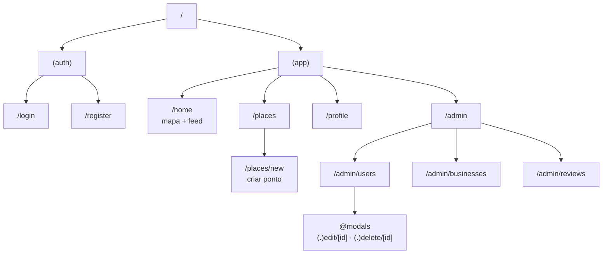
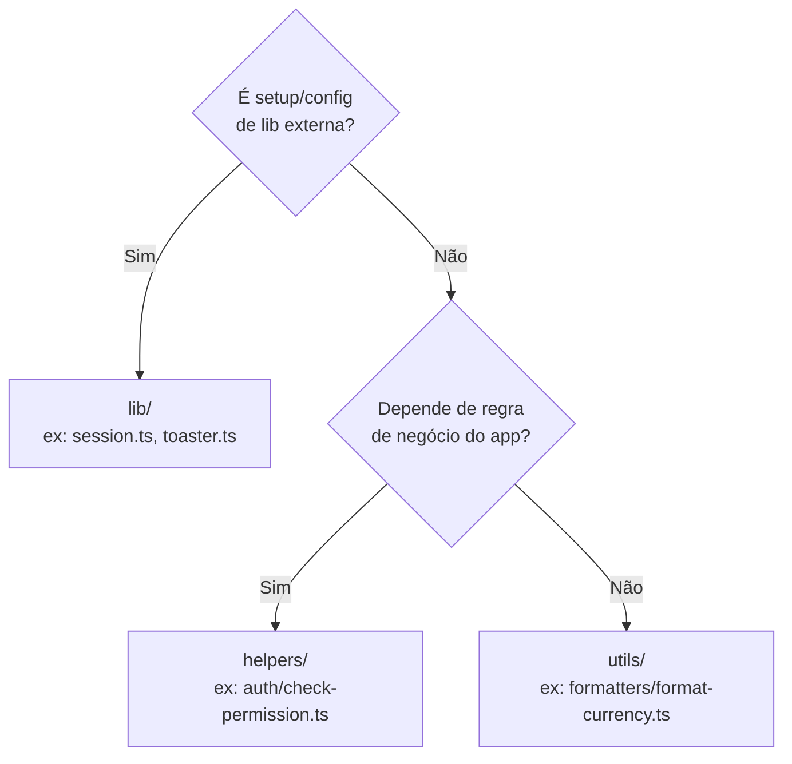

> ⚙️ **Trilha: implementado.** Estrutura do repo `soromaps_web`.

# 💻 11. Frontend web

Next.js 16 com App Router, React 19, TypeScript, Tailwind CSS 4 e shadcn/ui. Lint e formatação com Biome.

```bash
npm run dev      # servidor de desenvolvimento
npm run build    # build de produção
npm run lint     # biome check
npm run format   # biome format --write
```

---

## 🗺️ Mapa de rotas



| Route group | Papel |
|---|---|
| `(auth)` | Telas públicas de login e cadastro. Sessão ativa aqui redireciona para `/home` |
| `(app)` | Área autenticada, com sidebar compartilhada no `layout.tsx` |

Route group não aparece na URL — serve para compartilhar layout sem prefixo de rota.

### Rotas interceptadas em `/admin/users`

`@modals` é um **slot paralelo** que, junto com as rotas `(.)edit/[id]` e `(.)delete/[id]`, faz edição e exclusão abrirem como modal por cima da listagem quando a navegação parte de dentro do app — mas renderizarem como página inteira quando a URL é acessada diretamente ou recarregada. As rotas completas `edit/[id]` e `delete/[id]` existem exatamente para esse segundo caso, e `@modals/default.tsx` é o estado neutro do slot.

---

## 📂 Organização de pastas

O projeto adota o padrão **Dara (Stardust)**:

| Pasta | Papel | Estado |
|---|---|---|
| `src/app` | Rotas do App Router | Em uso |
| `src/actions` | Server Actions (`auth.ts`, `users/*`) | Em uso |
| `src/components` | `ui/` (shadcn), `blocks/`, `table/`, `skeletons/` | Em uso |
| `src/constants` | Constantes (`auth_constants.ts` com os regex de e-mail e senha) | Em uso |
| `src/hooks` | Hooks (`use-mobile.ts`) | Em uso |
| `src/lib` | Setup de libs externas e utilitários de infra (`session.ts`, `utils.ts`, `toaster.ts`) | Em uso |
| `src/types` | Contratos (`User`, `Review`) | Em uso |
| `src/validations` | Schemas Zod (`auth`, `users`, `review`) | Em uso |
| `src/config`, `src/content`, `src/contexts`, `src/helpers`, `src/http`, `src/mocks`, `src/reducers`, `src/styles`, `src/utils/*` | Criadas pelo scaffold Dara | Vazias, aguardando uso real |

### Onde colocar um arquivo novo



### Desvio consciente do Dara: `_components/` colocado

O Dara diz que `app/` deve conter só rotas (`layout`, `page`, `loading`, `error`, `not-found`). Este projeto **mantém `_components/` dentro das rotas** — `home/_components/marker.tsx`, `admin/users/_components/user-form.tsx` e afins.

**Motivo:** pasta com prefixo `_` é *private folder* do App Router (fica fora do roteamento por definição), e colocação é o idioma da comunidade Next.js para componente de uso exclusivo de uma rota. Empurrar tudo para `src/components/` afastaria o componente do único lugar que o usa.

**Regra prática:** usado por uma rota só → `_components/` daquela rota. Usado por duas ou mais → `src/components/`.

---

## 🗺️ Componente de mapa

[`src/components/ui/map.tsx`](../../src/components/ui/map.tsx) encapsula o MapLibre GL numa API declarativa em React:

| Recurso | Como funciona |
|---|---|
| Tema | Detecta a classe `dark`/`light` no `<html>` via `MutationObserver`, com fallback em `prefers-color-scheme` |
| Basemap | Estilos públicos CARTO: `positron` (claro) e `dark-matter` (escuro) |
| Viewport controlado | `viewport` + `onViewportChange` (centro, zoom, bearing, pitch) |
| Marcadores e popups | Renderizados como React via `createPortal` dentro dos elementos do MapLibre |
| Controles | `MapControls` com zoom, bússola, localizar e tela cheia |

Centro inicial fixo em Sorocaba: `[-47.44623758514884, -23.47205863818757]`, zoom `15.5`.

**Carregamento de marcadores:** `/home` busca `GET /api/markers` sempre que o zoom muda, e limpa a lista abaixo de zoom 14 para não poluir o mapa de longe. A filtragem é toda client-side.

---

## 🎨 UI

| Item | Escolha |
|---|---|
| Design system | shadcn/ui sobre Radix (`components.json` na raiz) |
| Estilo | Tailwind CSS 4 via `@tailwindcss/postcss`, tokens em `src/app/globals.css` |
| Ícones | `lucide-react` |
| Toasts | `sonner`, com wrapper em `src/lib/toaster.ts` |
| Drawer | `vaul`, com snap points — é o painel deslizante sobre o mapa em `/home` |
| Tema | `next-themes` |

---

## 🧹 Dependências sem uso

Instaladas em `package.json`, sem nenhum import em `src/`:

| Pacote | Provável origem |
|---|---|
| `firebase` | Tentativa anterior de backend/auth |
| `hono`, `@hono/node-server` | Tentativa anterior de API em Node |
| `leaflet`, `react-leaflet` | Primeira versão do mapa, antes do MapLibre |
| `shadcn` (como dependência de runtime) | Deveria ser `devDependency` — é CLI |

Não foram removidas nesta rodada de documentação. Ver backlog em [12 — Gap](./12-gap-modelo-vs-implementacao.md).

---

## 🧭 Decisões deste domínio

### Server Actions como caminho padrão de mutação
**Decisão:** mutações passam por `src/actions/*` com `"use server"`, validando com Zod antes de chamar a API.
**Motivo:** validação e chamada no mesmo lugar, sem endpoint público extra, e a URL da API fica privada em `API_URL`. Exceção atual: markers, que são chamados do cliente por causa da interatividade do mapa.

### Zod como fonte dos contratos de formulário
**Decisão:** todo formulário valida contra schema em `src/validations`, com o tipo inferido por `z.infer`.
**Motivo:** um único lugar define regra e tipo. **Inconsistência a resolver:** `registerSchema` (com `confirmPassword`) e `createUserSchema` (com `email`) coexistem e divergem — a tela de cadastro usa `createUserSchema`, deixando `registerSchema` sem uso claro.

---

## ➡️ Próxima página

[12 — Gap modelo × implementação](./12-gap-modelo-vs-implementacao.md)
