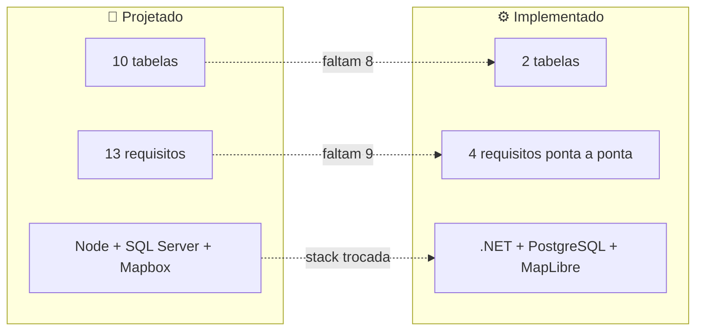

> 🔀 **Ponte entre as duas trilhas.** Esta é a página para consultar antes de estimar qualquer tarefa: mostra a distância real entre o que o TCC especificou e o que existe rodando.

# 🔀 12. Gap — modelo × implementação

---

## 🧱 Gap de stack

| Camada | Projetado | Implementado | Motivo da troca |
|---|---|---|---|
| Backend | Node.js + Express + TypeScript | ASP.NET Core 10 + EF Core | Alinhamento com a stack do time e com as disciplinas de C# |
| Banco | SQL Server | PostgreSQL (Npgsql) | Custo zero, provisionamento simples, caminho para PostGIS |
| Mapa | Mapbox API | MapLibre GL + basemaps CARTO | Sem token, sem conta, sem cota |
| Frontend | ReactJS | Next.js 16 (App Router, Server Actions) | SSR, roteamento e camada de servidor sem backend-for-frontend próprio |
| Nuvem | AWS | Não provisionado | — |
| Mobile | Expo (React Native) | Não iniciado | — |
| Topologia | Repo único implícito | Dois repos (`soromaps_web`, `soromaps_api`) | Deploy e histórico independentes |

---

## 🗄️ Gap de dados

| Entidade projetada | Tabela hoje | Situação |
|---|---|---|
| `Usuario` | `tbUsuario` | 🟡 Falta `tipoUsuario`, `CPF`, `CNPJ`, `pontuacao`, `nivel` |
| `PontoNoMapa` | `markers` | 🟡 Só `id`, `nome`, `lat`, `lng`. Faltam descrição, contato, foto, dono (FK), categoria (FK), status, endereço |
| `Categoria` | — | 🔴 Ausente |
| `Analise` | — | 🔴 Ausente — sem base para RF-07 e RF-10 |
| `Comentario` | — | 🔴 Ausente — sem base para RF-09 |
| `Favorita` | — | 🔴 Ausente |
| `Visita` | — | 🔴 Ausente — sem histórico, sem estatística de visitas |
| `Segue` | — | 🔴 Ausente — sem rede social (RF-13) |
| `Conquista` | — | 🔴 Ausente |
| `GanhaConquista` | — | 🔴 Ausente — gamificação inteira sem base |

**Consequência de produto:** dos três pilares do Soromaps, só a **geolocalização** tem persistência. Gamificação e rede social não existem no banco — e são justamente o que diferencia a plataforma de um mapa qualquer.

**Consequência para as personas:** sem `tipoUsuario`/`CNPJ`, o perfil de estabelecimento do Augusto não existe; sem `Analise`, a resenha detalhada da Sara não tem onde ser gravada.

---

## 📋 Gap de requisitos

| Situação | Requisitos |
|---|---|
| 🟢 Funcionando | RF-03 (mapa), RF-05 (criar ponto), RF-06 (configurar ponto) |
| 🟡 Parcial | RF-01, RF-02 (cadastro/perfil sem tipo de usuário), RF-04 (GPS sem persistência) |
| 🔴 Não iniciado | RF-07, RF-08, RF-09, RF-10, RF-11, RF-12, RF-13 |

---

## 🧹 Código morto e inconsistências

| Item | Onde | Detalhe |
|---|---|---|
| Route Handlers órfãos | `src/app/api/auth/login/route.ts`, `.../logout/route.ts` | Sem nenhum chamador; o front usa Server Actions |
| `registerSchema` sem uso | [`src/validations/auth.ts`](../../src/validations/auth.ts) | Nenhum import; o cadastro usa `createUserSchema` |
| `WeatherForecastController` | `soromaps_api/Controllers` | Resto do template `dotnet new webapi` |
| Caminho antigo do backend | [`.gitignore`](../../.gitignore) | Regras para `/src/services/Soromaps`, que não existe mais |
| Sem `.env.example` | raiz | As variáveis exigidas não estão documentadas em lugar nenhum do repo — ver [13](./13-ambiente-e-setup.md) |
| Sem atualização parcial de usuário | `soromaps_api/Controllers/UsersController.cs` | `PUT` re-hasheia a senha em toda chamada. Contorno atual: o formulário de edição **exige** a senha e avisa que ela será redefinida. Correção: `Password` opcional no `UserDTO` + re-hash condicional (ou um `PATCH`) |
| Chamadas de markers no cliente | `/home`, `/places/new`, popup do marcador | Ainda usam `fetch` direto com `NEXT_PUBLIC_API_URL`, fora do padrão `src/http` + server action adotado em usuários. **Quebradas em produção** — ver abaixo |
| `.env.example` ignorado pelo git | [`.gitignore`](../../.gitignore) | O arquivo existe na raiz, mas a regra `.env*` também o captura — quem clona não o recebe. Falta a exceção `!.env.example` |
| `bin/` e `obj/` versionados na API | `soromaps_api` | O repositório da API não tem `.gitignore`; binários compilados (`.dll`, `.exe`, `.pdb`) estão no controle de versão |

**Resolvidos nesta rodada:** `src/types/user.ts` (era `id: string` e expunha `password`); a tabela de usuários, que renderizava `userName` nas três colunas de dados; as cinco dependências não importadas, removidas; `shadcn` movida para `devDependencies`.

### 🔓 Estado das vulnerabilidades de pacote

De **15 para 0**. O que saiu e como:

| Origem | Ação | Resultado |
|---|---|---|
| `firebase`, `hono`, `@hono/node-server`, `leaflet`, `react-leaflet` | removidas (nenhum import em `src/`) | −9, incluindo a única `critical` (`websocket-driver`) |
| `next` 16.2.6 → **16.2.12** | atualização de patch | −1 `high` — era **bypass de middleware/proxy no App Router**, e o `middleware.ts` é a guarda de rota do projeto |
| `postcss` | `overrides` apertado para `^8.5.25` | −1 `high` |
| `sharp` | `overrides` para `^0.35.3` | −2 (mesmo advisory, contado pelo pacote e pelo Next que depende dele) |

O Next 16.2.12 ainda declara `sharp: ^0.34.5` — a 0.35 só vira dependência oficial a partir da canary `16.3.0`. O override força a versão corrigida antes disso chegar à stable; validado com `npm run build` (as 4 telas com `next/image` — login, cadastro e os dois blocos do feed — seguiram funcionando).

> ⚠️ **Ponto de atenção herdado:** por não ser a versão que o Next testou oficialmente, vale reconferir este override a cada bump de versão do Next — se uma stable futura declarar `sharp: ^0.36` ou remover compatibilidade com a 0.35, o override pode precisar de ajuste.

> 🚫 **Nunca rodar `npm audit fix --force` neste projeto.** Antes deste ajuste, a "correção" que ele propunha para o `sharp` era instalar `next@14.2.35` — regressão de dois majors. Com override manual, o problema nem aparece.

---

## 🔴 Gap entre local e produção

O projeto está publicado (Vercel + Azure + Supabase), e o código **não acompanhou** essa mudança em um ponto: as chamadas client-side do mapa.

| Funcionalidade | Local | Produção |
|---|---|---|
| Login, cadastro, sessão | ✅ | ✅ |
| CRUD de usuários (`/admin/users`) | ✅ | ✅ |
| Listar / criar / editar / excluir marcadores | ✅ | ❌ |

O motivo são dois defeitos empilhados: sem `NEXT_PUBLIC_API_URL` na Vercel (decisão deliberada — a URL da API é segredo), o `fetch` cai no fallback `""` e vira caminho relativo, dando 404; e mesmo que não desse, o CORS do `Program.cs` só conhece `http://localhost:3000`.

O que separa as duas linhas da tabela: tudo que funciona passa pelo **servidor** (Server Actions e `src/http`, que leem `API_URL` privada); tudo que quebrou passa pelo **navegador**.

Diagnóstico completo e a correção proposta — uma rota `/api/proxy/[...path]` no Next, que resolve os dois defeitos e ainda mantém a URL da API fora do bundle — em [14 — Deploy](./14-deploy.md#-estado-de-produção).

---

## 🚦 Backlog priorizado

### 🔥 Prioridade 0 — quebrado em produção

1. **Criar a rota `/api/proxy/[...path]`** e migrar as chamadas de markers para ela — devolve o mapa ao ar, dispensa o CORS e mantém a URL da API fora do bundle. Ver [14 — Deploy](./14-deploy.md#a-correção-rota-de-proxy)

> Enquanto o proxy não existe, o paliativo é definir `NEXT_PUBLIC_API_URL` na Vercel **e** liberar a origem no CORS. Funciona, mas publica a URL da API no bundle — e, como a API não tem autenticação, entrega um CRUD de usuários aberto a quem abrir o DevTools. **Não faça isso sem antes resolver o item 2.**

### 🔴 Prioridade 1 — segurança

2. Registrar autenticação na API (`AddAuthentication` + `[Authorize]` nos controllers) — hoje todo endpoint é público, **e agora está publicado na internet**
3. Parar de devolver `user_password` nas respostas de `/api/users` (DTO de saída)
4. Constraint `UNIQUE` em `user_name` e `user_email`
5. Resposta genérica de erro no login (fim da enumeração de usuários)
6. Papel/role de administrador, checado no middleware **e** na API

Contexto completo em [10 — Autenticação e sessão](./10-autenticacao-e-sessao.md).

### 🟠 Prioridade 2 — fundação

7. Adicionar EF Core Migrations — o schema hoje é mantido à mão em dois lugares (local e Supabase), sem nada que os compare
8. Ligar `markers` ao usuário criador (FK `UsuarioDono`)
9. Padronizar nomenclatura de tabelas e colunas
10. Tornar a origem de CORS configurável (hoje `http://localhost:3000` fixo em `Program.cs`)
11. Versionar o `.env.example` (hoje capturado pela regra `.env*`) e criar um no repo da API
12. Criar `.gitignore` no repo da API e tirar `bin/`/`obj/` do controle de versão
13. Aceitar atualização parcial de usuário na API (senha opcional no `PUT`, ou um `PATCH`)
14. Levar markers para o padrão `src/http` + server action, tirando o `fetch` do cliente
15. Camada de env validada com `server-only` e `src/lib/fetcher.ts`
16. Pipeline de deploy da API (hoje é publish manual pelo Visual Studio)

### 🟡 Prioridade 3 — produto

17. `Categoria` + `Analise` → destrava RF-07 e RF-11/RF-12
18. `Comentario` → destrava RF-09
19. Upload de foto → RF-08
20. `Segue` → RF-13
21. `Conquista`/`GanhaConquista` → gamificação
22. Paginação e filtro por bounding box em `/api/markers` (o front já tem o hook pronto para paginação server-side)
23. Aplicar o padrão de listagem em `/admin/businesses` e `/admin/reviews`, hoje stubs

### 🟢 Prioridade 4 — limpeza

24. Apagar os Route Handlers órfãos e o `WeatherForecastController`
25. Limpar as regras obsoletas do `.gitignore` (`/src/services/Soromaps`)
26. Remover `registerSchema` de `src/validations/auth.ts` ou passar a usá-lo
27. Reconferir o override de `sharp` quando o Next bumpar de versão (ver seção de vulnerabilidades)

---

## 🧭 Como manter esta página honesta

Ela envelhece rápido por definição. A regra: **toda tarefa concluída do backlog acima atualiza esta página e o [`CLAUDE.md`](../../CLAUDE.md) na mesma entrega** — não no fim da sprint.

---

## ➡️ Próxima página

[13 — Ambiente e setup](./13-ambiente-e-setup.md)
