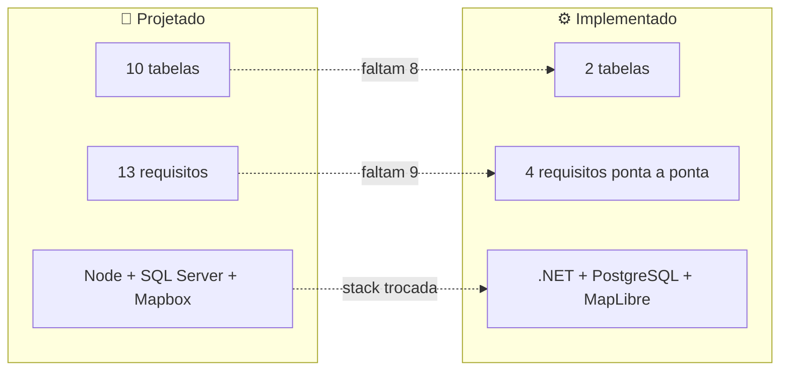

> 🔀 **Ponte entre as duas trilhas.** Esta é a página para consultar antes de estimar qualquer tarefa: mostra a distância real entre o que o TCC especificou e o que existe rodando.

# 🔀 12. Gap — modelo × implementação

---

## 🧱 Gap de stack

| Camada | Projetado | Implementado | Motivo da troca |
|---|---|---|---|
| Backend | Node.js + Express + TypeScript | ASP.NET Core 10 + EF Core | Alinhamento com a stack do time e com as disciplinas de C# |
| Banco | SQL Server | PostgreSQL (Npgsql) | Custo zero, provisionamento simples, caminho para PostGIS |
| Mapa | Mapbox API | MapLibre GL + basemaps CARTO | Sem token, sem conta, sem cota |
| Frontend | ReactJS | Next.js 16 (App Router, Server Actions) | SSR, roteamento e camada de servidor sem backend-for-frontend próprio |
| Nuvem | AWS | Não provisionado | — |
| Mobile | Expo (React Native) | Não iniciado | — |
| Topologia | Repo único implícito | Dois repos (`soromaps_web`, `soromaps_api`) | Deploy e histórico independentes |

---

## 🗄️ Gap de dados

| Entidade projetada | Tabela hoje | Situação |
|---|---|---|
| `Usuario` | `tbUsuario` | 🟡 Falta `tipoUsuario`, `CPF`, `CNPJ`, `pontuacao`, `nivel` |
| `PontoNoMapa` | `markers` | 🟡 Só `id`, `nome`, `lat`, `lng`. Faltam descrição, contato, foto, dono (FK), categoria (FK), status, endereço |
| `Categoria` | — | 🔴 Ausente |
| `Analise` | — | 🔴 Ausente — sem base para RF-07 e RF-10 |
| `Comentario` | — | 🔴 Ausente — sem base para RF-09 |
| `Favorita` | — | 🔴 Ausente |
| `Visita` | — | 🔴 Ausente — sem histórico, sem estatística de visitas |
| `Segue` | — | 🔴 Ausente — sem rede social (RF-13) |
| `Conquista` | — | 🔴 Ausente |
| `GanhaConquista` | — | 🔴 Ausente — gamificação inteira sem base |

**Consequência de produto:** dos três pilares do Soromaps, só a **geolocalização** tem persistência. Gamificação e rede social não existem no banco — e são justamente o que diferencia a plataforma de um mapa qualquer.

**Consequência para as personas:** sem `tipoUsuario`/`CNPJ`, o perfil de estabelecimento do Augusto não existe; sem `Analise`, a resenha detalhada da Sara não tem onde ser gravada.

---

## 📋 Gap de requisitos

| Situação | Requisitos |
|---|---|
| 🟢 Funcionando | RF-03 (mapa), RF-05 (criar ponto), RF-06 (configurar ponto) |
| 🟡 Parcial | RF-01, RF-02 (cadastro/perfil sem tipo de usuário), RF-04 (GPS sem persistência) |
| 🔴 Não iniciado | RF-07, RF-08, RF-09, RF-10, RF-11, RF-12, RF-13 |

---

## 🧹 Código morto e inconsistências

| Item | Onde | Detalhe |
|---|---|---|
| Route Handlers órfãos | `src/app/api/auth/login/route.ts`, `.../logout/route.ts` | Sem nenhum chamador; o front usa Server Actions |
| `registerSchema` sem uso | [`src/validations/auth.ts`](../../src/validations/auth.ts) | Nenhum import; o cadastro usa `createUserSchema` |
| Deps não importadas | `package.json` | `firebase`, `hono`, `@hono/node-server`, `leaflet`, `react-leaflet` |
| `shadcn` como dependência de runtime | `package.json` | É CLI — lugar dela é em `devDependencies` |
| `WeatherForecastController` | `soromaps_api/Controllers` | Resto do template `dotnet new webapi` |
| Caminho antigo do backend | [`.gitignore`](../../.gitignore) | Regras para `/src/services/Soromaps`, que não existe mais |
| `User.id` como `string` | [`src/types/user.ts`](../../src/types/user.ts) | A API devolve `int`; o tipo também expõe `password` |
| Sem `.env.example` | raiz | As variáveis exigidas não estão documentadas em lugar nenhum do repo — ver [13](./13-ambiente-e-setup.md) |

---

## 🚦 Backlog priorizado

### 🔴 Prioridade 1 — segurança (antes de qualquer deploy)

1. Registrar autenticação na API (`AddAuthentication` + `[Authorize]` nos controllers) — hoje todo endpoint é público
2. Parar de devolver `user_password` nas respostas de `/api/users` (DTO de saída)
3. Constraint `UNIQUE` em `user_name` e `user_email`
4. Resposta genérica de erro no login (fim da enumeração de usuários)
5. Papel/role de administrador, checado no middleware **e** na API

Contexto completo em [10 — Autenticação e sessão](./10-autenticacao-e-sessao.md).

### 🟠 Prioridade 2 — fundação

6. Adicionar EF Core Migrations (hoje o schema é criado à mão)
7. Ligar `markers` ao usuário criador (FK `UsuarioDono`)
8. Padronizar nomenclatura de tabelas e colunas
9. Tornar a origem de CORS configurável (hoje `http://localhost:3000` fixo em `Program.cs`)
10. Criar `.env.example` nos dois repos

### 🟡 Prioridade 3 — produto

11. `Categoria` + `Analise` → destrava RF-07 e RF-11/RF-12
12. `Comentario` → destrava RF-09
13. Upload de foto → RF-08
14. `Segue` → RF-13
15. `Conquista`/`GanhaConquista` → gamificação
16. Paginação e filtro por bounding box em `/api/markers`

### 🟢 Prioridade 4 — limpeza

17. Remover deps não importadas e mover `shadcn` para `devDependencies`
18. Apagar os Route Handlers órfãos e o `WeatherForecastController`
19. Limpar as regras obsoletas do `.gitignore`
20. Corrigir `src/types/user.ts` (`id: number`, sem `password`)

---

## 🧭 Como manter esta página honesta

Ela envelhece rápido por definição. A regra: **toda tarefa concluída do backlog acima atualiza esta página e o [`CLAUDE.md`](../../CLAUDE.md) na mesma entrega** — não no fim da sprint.

---

## ➡️ Próxima página

[13 — Ambiente e setup](./13-ambiente-e-setup.md)
