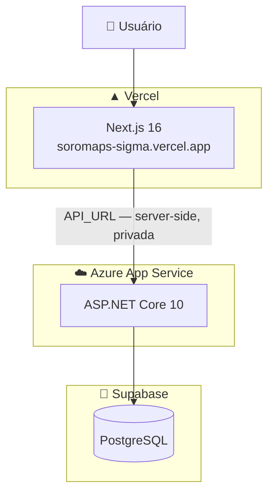
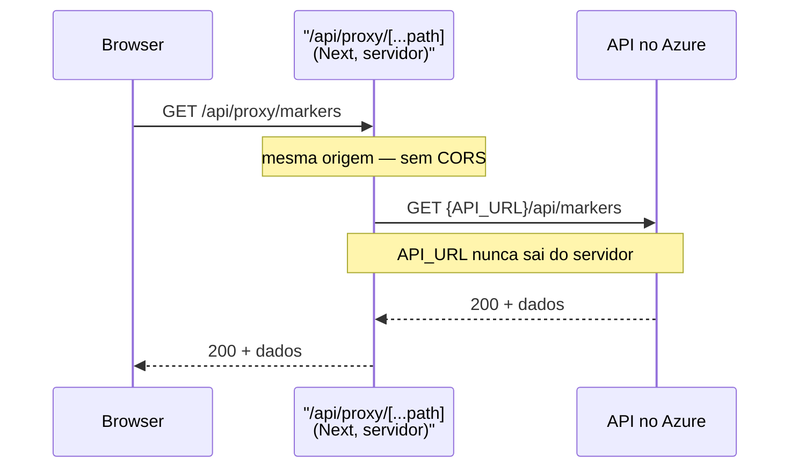

> ⚙️ **Trilha: implementado.** Estado real dos ambientes em 29/07/2026. Inclui um defeito conhecido em produção — ver [Estado de produção](#-estado-de-produção).

# 🚀 14. Deploy e infraestrutura

Três serviços, três provedores:

| Camada | Provedor | O que roda |
|---|---|---|
| Front-end | **Vercel** | Next.js 16 — [soromaps-sigma.vercel.app](https://soromaps-sigma.vercel.app) |
| API | **Azure App Service** | ASP.NET Core 10. URL tratada como segredo |
| Banco | **Supabase** | PostgreSQL gerenciado |



---

## ▲ Front-end — Vercel

**Deploy:** automático a cada push na branch principal, pela integração do GitHub com a Vercel. Não há workflow no repositório — a Vercel dispara o build sozinha.

**Variáveis de ambiente** (painel da Vercel, não versionadas):

| Variável | Papel | Exposta ao browser? |
|---|---|---|
| `API_URL` | URL da API no Azure, usada por Server Actions e pela camada `src/http` | **Não** |
| `SESSION_SECRET` | Segredo HMAC que assina o cookie de sessão | **Não** |

> `NEXT_PUBLIC_API_URL` **não é definida em produção**, por decisão: a URL da API é tratada como segredo, e qualquer variável com esse prefixo é gravada em texto puro no JavaScript que o visitante baixa. A consequência disso está em [Estado de produção](#-estado-de-produção).

---

## ☁️ API — Azure App Service

**Deploy:** manual ("na unha") — publish pelo Visual Studio / Azure CLI. Não existe `.github/workflows` no repositório da API.

**Configuração** (Application Settings do App Service, não versionadas):

| Chave | Valor |
|---|---|
| `ConnectionStrings__DefaultConnection` | String de conexão do Supabase |

O `appsettings.json` versionado mantém `DefaultConnection` **vazia** de propósito — o valor real nunca entra no repositório. O `__` (duplo underscore) é a convenção do .NET para representar aninhamento de configuração em variável de ambiente.

---

## 🐘 Banco — Supabase

PostgreSQL gerenciado, acessado pela API via `Npgsql`.

O schema foi criado **manualmente no SQL Editor** do painel. O projeto continua sem EF Core Migrations, então:

- não há forma reproduzível de recriar o banco do zero;
- mudança de model não gera diff versionado;
- o modelo lógico do TCC não tem caminho automático para virar schema.

Detalhe das tabelas em [08 — Banco atual](./08-banco-atual.md).

> 💡 Ao montar a connection string, o Supabase oferece **conexão direta** (porta 5432) e **pooler** (6543, PgBouncer). Para uma API .NET com pool próprio do Npgsql em App Service, a conexão direta costuma ser a escolha certa; o pooler em modo transaction não suporta prepared statements, que o Npgsql usa por padrão. Se aparecerem erros de prepared statement, é esse o motivo.

---

## 🔴 Estado de produção

**As funcionalidades de mapa estão quebradas em produção.** São dois defeitos empilhados no mesmo caminho, e vale entender a ordem porque o primeiro acontece antes do segundo:

### 1. O `fetch` vira caminho relativo

`/home`, `/places/new` e o popup do marcador são Client Components e leem a URL assim:

```ts
const API_URL = process.env.NEXT_PUBLIC_API_URL || "";
fetch(`${API_URL}/api/markers`);
```

Sem `NEXT_PUBLIC_API_URL` definida, `API_URL` vira `""` e a chamada final é `fetch("/api/markers")` — um caminho **relativo**, que bate em `soromaps-sigma.vercel.app/api/markers`. Essa rota não existe no Next: **404**.

### 2. O CORS não conhece a Vercel

Mesmo que a variável fosse definida, `Program.cs` libera uma única origem:

```csharp
policy.WithOrigins("http://localhost:3000")
```

O navegador bloquearia a chamada vinda de `soromaps-sigma.vercel.app`.

### O que continua funcionando

Login, cadastro e o CRUD de usuários — porque passam por Server Actions e pela camada `src/http`, que rodam **no servidor** com `API_URL` e nunca dependem de CORS.

### A correção: rota de proxy

Em vez de reexpor a URL da API com `NEXT_PUBLIC_API_URL` (o que anularia a decisão de tratá-la como segredo), o caminho é um **proxy no próprio Next**:



Resolve os dois defeitos de uma vez:

| Problema | Como o proxy resolve |
|---|---|
| 404 por caminho relativo | O caminho relativo passa a existir de verdade |
| CORS bloqueando | Mesma origem — CORS deixa de se aplicar |
| URL da API no bundle | Nunca chega ao browser; só o servidor Next a conhece |

É o padrão `proxy-e-segredos` usado pelo time. Enquanto ele não existe, a alternativa mínima é definir `NEXT_PUBLIC_API_URL` na Vercel **e** liberar a origem no CORS — o que funciona, mas publica a URL da API no bundle.

---

## 🧭 Decisões deste domínio

### URL da API como segredo
**Decisão:** não definir `NEXT_PUBLIC_API_URL` em produção.
**Motivo:** `NEXT_PUBLIC_` significa **público** — o valor é substituído em texto puro num `.js` que qualquer visitante baixa. Como a API não tem autenticação ([ver riscos](./10-autenticacao-e-sessao.md)), publicar a URL entregaria um endpoint aberto de CRUD de usuários a quem abrisse o DevTools. **Custo assumido:** as chamadas client-side de markers pararam, até a rota de proxy existir.

### Três provedores em vez de um só
**Decisão:** Vercel (front), Azure (API) e Supabase (banco).
**Motivo:** cada camada foi para onde tem melhor tier gratuito e menos configuração — Next.js na Vercel é deploy sem configuração alguma; ASP.NET Core no Azure é o caminho de menor atrito; Postgres gerenciado no Supabase evita administrar servidor de banco. **Custo:** três painéis para configurar, três lugares onde uma variável de ambiente pode faltar.

### Deploy manual da API
**Decisão:** publish pelo Visual Studio, sem pipeline.
**Motivo:** escopo de TCC e frequência baixa de alteração no backend. Vale montar um workflow de GitHub Actions quando o backend passar a mudar com regularidade — hoje o risco é publicar de uma máquina com estado local diferente do repositório.

---

## ⬅️ Voltar

[00 — Home](./00-home.md)
